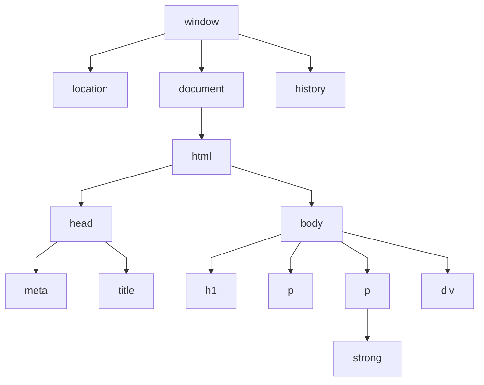
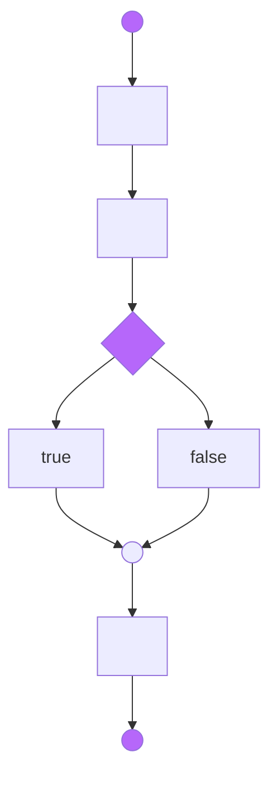
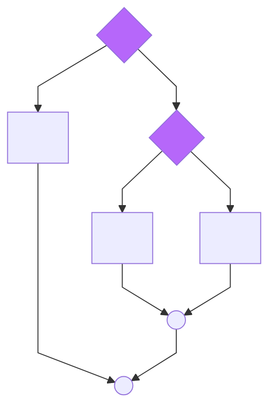
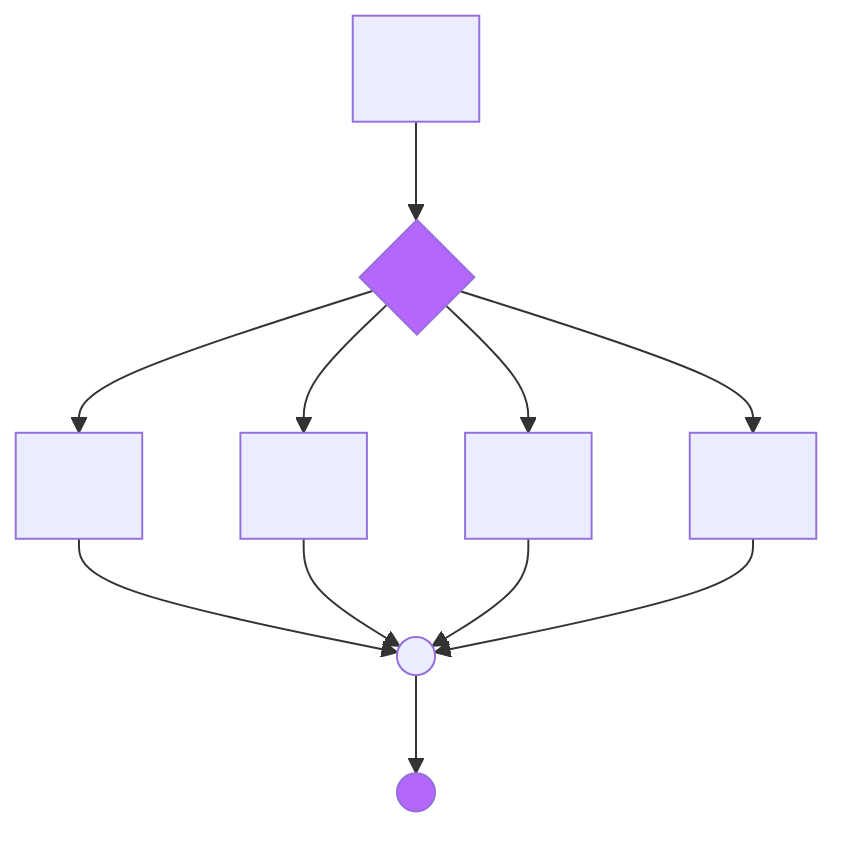
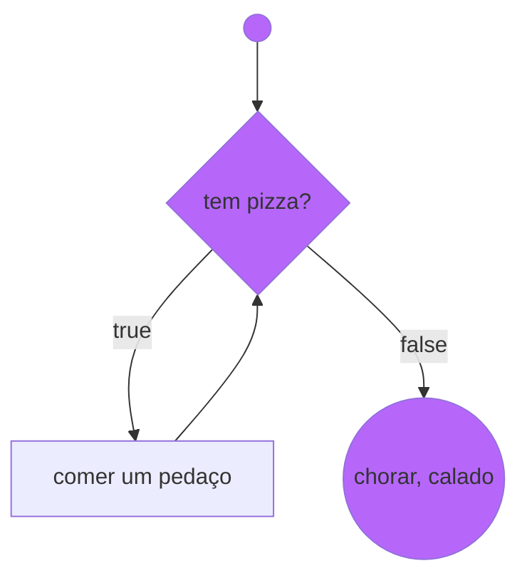
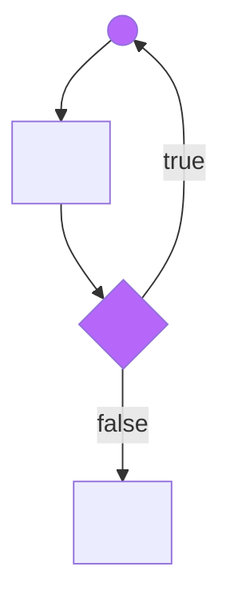
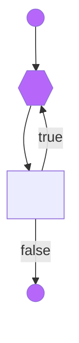

# Anotações referente ao curso 'JavaScript' - **Em Atualização!!!**

## **JavaScript**
* Você pode acessar em: [Curso em Vídeo](https://www.youtube.com/watch?v=1-w1RfGIov4&list=PLHz_AreHm4dlsK3Nr9GVvXCbpQyHQl1o1) (gratuito)


## Documentação

[JavaScript](https://developer.mozilla.org/pt-BR/docs/Web/JavaScript)

[EcmaScript](https://www.ecma-international.org/publications-and-standards/standards/ecma-262/)

## Tipos

typeof

## Primeiros comandos

 `window.alert()`

 `window.confirm()`

 `window.prompt()`

## comentários

```js
// comentario em uma linha
/* comentario 
em 
varias
linhas
*/
``
`

## Variáveis

`
``
js
var nomeVariavel;
let nomeVariavel;
const nomeVariavel;
```

nomes de variáveis:

* Podem começar com letras, $ ou _
* Não pode começar com números
* É possível usar letras ou números
* É possível usar usar acentos e símbolos
* não pode conter espaços
* não podem ser palavras reservadas
* Maiusculo e minusculo fazem diferença
* tente escolher nomes coerentes para as variáveis

Primitivos:
* Number
  + Infinity
  + NaN
* String
* Boolean
* Null
* undefined
* object
* function

Existem 3 formas de delimitar uma string usando `""` , `''` ou ` `  ` ` ; 
  
(number + number) = adição  
(string + string) = concatenação

## Number

### Formatando Number

number.toFixed(n) -> retorna o numero arredondado
* caso sem valor, não terá parte fracionária
* se tiver valor, o número será retornado com a mesma quantidade de decimais.

exemplo:

```js
var numObj = 12345.6789;

numObj.toFixed(); // Retorna '12346': note o arredondamento, não possui nenhuma parte fracionária
numObj.toFixed(1); // Retorna '12345.7': note o arredondamento
```

Para moeda br:  
```js
number.toLocaleString( "pt-Br" , {style: 'currency', currency: 'BRL'})
```

### String > Number  

Number.parseInt(n) -> Números inteiros  
Number.parseFloat(n) -> Números decimais
Number(n)

### Number > String

String(n)
n.toString(n)

## String

s.length -> quantos caracteres
s.toUpperCase() -> tudo para maiuscula
s.toLowerCase() -> tudo pra minusculo
s

## Formatando Strings

```js
var s = 'JavaScript'
'Estou aprendendo s' // não faz interpolação
'Eu estou aprendendo' + s // usa concatenação
    `Eu estou aprendendo ${s}` // usa template string
```

replace(x, y) -> troca x por y.

# Operadores
* aritméticos 
* atribuição
* relacionais
* lógicos
* ternário

## aritméticos  

```js
5 + 2 = 7
5 - 2 = 3
5 * 2 = 10
5 / 2 = 2.5
5 % 2 = 1 //resto da divisão inteira  
5 ** 2 = 25
```

### ordem de precedência

` `()` `  
` `**` `  
` `* / %` `  
` `+ - ` `

## atribuição

```js
var n = 3
n = n + 4 n += 4
n = n - 5 n -= 5
n = n * 4 n *= 4
n = n / 2 n /= 2
n = n ** 2 n **= 2
n = n % 5 n %= 5
```

Incremento

```js
var x = 5
x = x + 1 x += 1 x++
x = x - 1 x -= 1 x--
```

### relacionais

resultado = valor boolean

```js
5 > 2 true
7 < 4 false
8 >= 8 true
9 <= 7 false
5 == 5 true
4 != 4 false
```

Identidade

```js
5 == 5 true
5 == '5'
true
5 === '5'
false
5 === 5 true
```

## lógicos

```js
!negação
    &&
    conjunção(e) ||
    disjunção(ou)
```

ordem: `!` > `&&` > `||`

### Ordem de precedência:  

aritméticos: ` `()`  ` >  `  ` **`  ` >  `  `* / %`  ` > `  `+ - ` `  
relacionais: o que vem primeiro  
lógicos: `!` > `&&` > `||`

### ternário

 teste ` `?`  ` true `  `:` ` false

# DOM - Document Object Model  

## Árvore DOM



Selecionando por:
* Marca: ``getElementsByTagName()``
* ID: ``getElementsById()``
* Nome: ``getElementsByName()``
* Classe: ``getElementsByClassName()``
* Seletor: ``querySelector()`` ou ``querySelectorAll()``

## Eventos Dom

exemplos:
* mouse enter -> quando entra no elemento
* mouse move -> quando o se move dentro do elemento
* mouse down -> quando clica dentro do elemento
* mouse up -> quando solta o click dentro do elemento
* click -> o clique inteiro dentro do elemento
* mouse out -> quando o mouse sai do elemento
# Condicões



```js
if (condição) {
    true
} else {
    false
}
```

## Condições aninhadas



```js
if (condição 1) {
    bloco 1
} else {
    if (condição 2) {
        bloco 2
    } else {
        bloco 3
    }
}
```

## Condição Múltipla



```js
switch (expressão) {
    case valor 1:
        bloco 1
        break
    case valor:
        ;
        bloco 2
        break
    case valor 3:
        bloco 3
        break
    default:
        bloco 4
        break
}
```

# Repetições



```js
while (condição) {
    bloco 1
}
```



```js
do {
    bloco 1
} while (condição)
```



```js
for (inicialização; teste lógico; incremento) {
    bloco 1
}
```

# Variáveis

### Variáveis simples:

* conseguem armanezar apenas **um valor** por vez.

### Variáveis compostas:

* devem ser capazes de armazenar **vários valores** em uma mesma estrutura

```js
"Um array ou vetor é uma variável que tem vários elementos e cada elemento é composto por seu valor e por uma chave de identificação(index)" 
```

|---|---|---|  
|car1|car2| car3|
|---|---|---|


# Array
- ``array[indice]`` = valor
- ``array.push(valor)``: adiciona o valor que está dentro dos () no final do array
- `array.length`: atributo para saber o comprimento do vetor
- `array.sort()`: ordena o array, transforma os elementos em string e compara com as sequencias do valor das unidades de código UTF-16(abaixo do 10 funciona pra ordenar números dentro do array)

```js
for(let i = 0;i < array.length; i++){
  console.log(array[i])
}
```
```js
for(let i in array){
  console.log(array[i])
}
```
```js
array.forEach( (elemento) => {console.log(`A posição ${array.indexOf(elemento)} tem o valor ${elemento}`)})
```
- ``indexOf = -1`` quando o elemento não foi encontrado

# Funções
```js
"São ações executadas assim que são chamadas ou em decorrência de algum evento."
```

```js
function ação(parametros){
  return resultado
}

ação(5) // chamando a função
```

```js
function parimp(n){
    if(n % 2 == 0) {
      return console.log(`O número ${n} é par`)
    } else {
      return console.log(`O número ${n} é impar`)
    }
  }
  let numero = parimp(11)
```
Funções podem ter: chamada, parametro, ação, retorno.

- recursividade: quando a função chama ela mesmo.
# daqui pra frente

- functions
- objeto
- modularização
- regex
- json
- ajax
- nodejs

## Comandos

- shift + alt + seta - esse comando duplica a linha =D

## Terminal

obs: não esqueça de fechar os terminais: 
* no node ->  .exit
* terminal vscode -> exit
* Ctrl+L = Limpa o terminal do vscode
