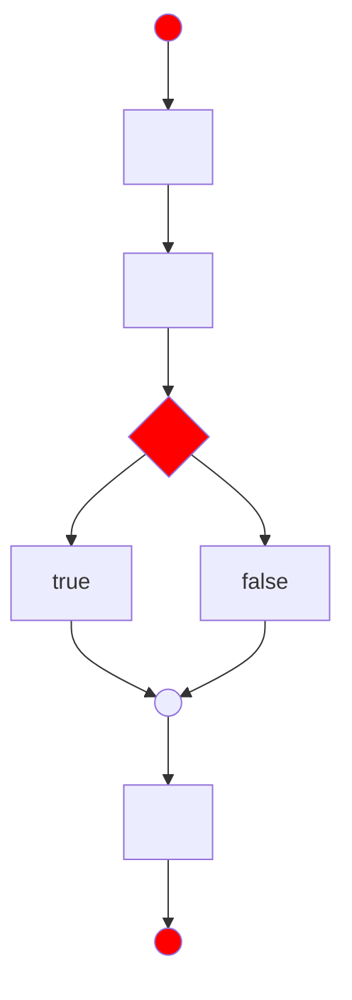
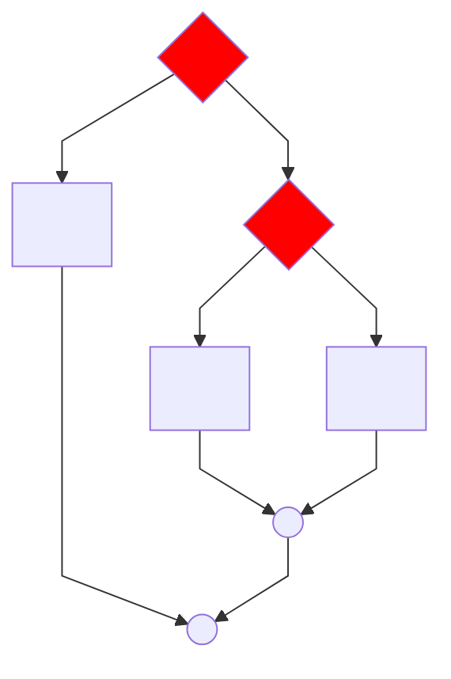

# Anotações referente ao curso 'JavaScript' - **Em Atualização!!!**


## Documentação

[JavaScript](https://developer.mozilla.org/pt-BR/docs/Web/JavaScript)

[EcmaScript](https://www.ecma-international.org/publications-and-standards/standards/ecma-262/)

## Tipos
typeof

## Primeiros comandos

`window.alert()`

`window.confirm()`

`window.prompt()`


## comentários

```js
// comentario em uma linha
/* comentario 
em 
varias
linhas
*/
``` 

## Variáveis
```js
var nomeVariavel;
let nomeVariavel;
const nomeVariavel;
```

nomes de variáveis:

- Podem começar com letras, $ ou _
- Não pode começar com números
- É possível usar letras ou números
- É possível usar usar acentos e símbolos
- não pode conter espaços
- não podem ser palavras reservadas
- Maiusculo e minusculo fazem diferença
- tente escolher nomes coerentes para as variáveis

Primitivos:
- Number
  - Infinity
  - NaN
- String
- Boolean
- Null
- undefined
- object
- function


Existem 3 formas de delimitar uma string usando `""`, `''` ou ` `` `;
  
(number + number) = adição  
(string + string) = concatenação

## Number

### Formatando Number


number.toFixed(n) -> retorna o numero arredondado
- caso sem valor, não terá parte fracionária
- se tiver valor, o número será retornado com a mesma quantidade de decimais.


exemplo:
```js
var numObj = 12345.6789;

numObj.toFixed();       // Retorna '12346': note o arredondamento, não possui nenhuma parte fracionária
numObj.toFixed(1);      // Retorna '12345.7': note o arredondamento
```
Para moeda br:  
number.toLocaleString(`pt-BR`, {style: 'currency', currency: 'BRL'})

### String > Number  
Number.parseInt(n) -> Números inteiros  
Number.parseFloat(n) -> Números decimais
Number(n)

### Number > String

String(n)
n.toString(n)


## String
s.length -> quantos caracteres
s.toUpperCase() -> tudo para maiuscula
s.toLowerCase() -> tudo pra minusculo
s

## Formatando Strings
```js
var s = 'JavaScript'
'Estou aprendendo s' // não faz interpolação
'Eu estou aprendendo' + s // usa concatenação
`Eu estou aprendendo ${s}` // usa template string
```
replace(x, y) -> troca x por y.


# Operadores
- aritméticos 
- atribuição
- relacionais
- lógicos
- ternário


## aritméticos  
```js
5 + 2 = 7   
5 - 2 = 3  
5 * 2 = 10  
5 / 2 = 2.5  
5 % 2 = 1 //resto da divisão inteira  
5 ** 2 = 25
```
### ordem de precedência
``()``  
``**``  
``* / %``  
``+ - ``


## atribuição


```js
var n = 3
n = n + 4    n += 4
n = n - 5    n -= 5
n = n * 4    n *= 4
n = n / 2    n /= 2
n = n ** 2   n **= 2
n = n % 5    n %= 5
```


Incremento
```js
var x = 5
x = x + 1   x += 1  x++
x = x - 1   x -= 1  x--
```
### relacionais
resultado = valor boolean
```js
5 > 2  true
7 < 4  false
8 >= 8  true
9 <= 7  false
5 == 5  true
4 != 4  false
```
Identidade
```js
5 == 5  true
5 == '5' true
5 === '5' false
5 === 5  true
```

## lógicos
```js
! negação 
&& conjunção (e)
|| disjunção (ou)
```
ordem: `!` > `&&` > `||`

### Ordem de precedência:  
aritméticos: ``()`` >  `` **`` >  ``* / %`` > ``+ - ``  
relacionais: o que vem primeiro  
lógicos: `!` > `&&` > `||`

### ternário
 teste ``?`` true ``:`` false


# DOM - Document Object Model  
## Árvore DOM


Selecionando por:
- Marca: ``getElementsByTagName()``
- ID: ``getElementsById()``
- Nome: ``getElementsByName()``
- Classe: ``getElementsByClassName()``
- Seletor: ``querySelector()`` ou ``querySelectorAll()``

## Eventos Dom
exemplos:
- mouse enter -> quando entra no elemento
- mouse move -> quando o se move dentro do elemento
- mouse down -> quando clica dentro do elemento
- mouse up -> quando solta o click dentro do elemento
- click -> o clique inteiro dentro do elemento
- mouse out -> quando o mouse sai do elemento

# Condicões



```js
if (condição) {
  true
} else {
  false
}
```
## Condições aninhadas


```js
if (condição 1) {
  bloco 1
} else {
  if (condição 2) {
    bloco 2
  } else {
    bloco 3
  }
}
```


## Terminal
obs: não esqueça de fechar os terminais: 
- no node ->  .exit
- terminal vscode -> exit
- Ctrl+L = Limpa o terminal do vscode